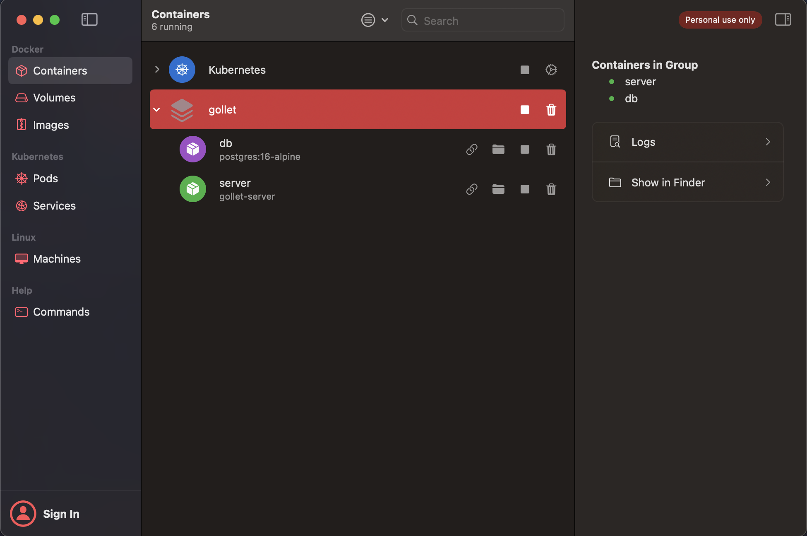

# gollet

Hello there... If you're reading this, then you will see how silly my attempt on tryna write a Golang REST Api. T-T

In case you're interested to run this project in your local machine. Here's a Step by step guide on how to do so.

## Step 1

Firstly, we need to make sure that we have already installed the correct version of the golang compiler in our local machine.
Assuming that you've already `git clone` this repo and you're already in the root path of the project.

Now, let's start by making sure we have the correct golang compiler. If you're using ASDF then, you can easily install them by doing so.

```
# This will install the golang plugin
asdf plugin-add golang

# install the golang version based on the .tool-versions
asdf install
```

## Step 2

Since, we are using docker to help make things easier for anyone to setup and run the server. Therefore, we can easily use the `docker-compose.yaml` script to run the server in docker instances.

We can simply setup and destroy the docker instance by running these command

```
# To create the docker instance
$ docker-compose up -d --build

# To destroy the docker instance
$ docker-compose down
```

After running the `docker-compose up -d --build` command. You will notice there will be a new instances created in your docker. Since I'm using OrbStack to manage my docker instances. Therefore, I added a screenshot on what you will see after we run the docker compose command.


[](#)

The REST api are now expose on our localhost port 8080.

But, if you're more interested to run the server locally. You can do so easily by running this command in your CLI.

```
go ./cmd/gollet/main.go
```

This command will setup the database for you (Assuming you already have postgres installed) if it doesn't exist and run the migration. Then it will start the server at port 8080.

## Step 3

Now, after we have successfully run the server on our docker. We can now test the backend service by sending a request to these path

```
# For user signup and login
POST http://localhost:8080/api/users/signup

{
    "email": "email@example.com",
    "password": "password123"
}

POST http://localhost:8080/api/users/login

{
    "email": "email@example.com",
    "password": "password123"
}

# For wallet interactions
POST http://localhost:8080/api/users/:user_id/wallets/deposit

{
    "amount": 50.00,
    "currency": "USD"
}

POST http://localhost:8080/api/users/:user_id/wallets/withdraw

{
    "amount": 15.00,
    "currency": "USD"
}

POST http://localhost:8080/api/users/:user_id/wallets/transfer

{
    "amount": 5.00,
    "recipient_user_id": 3
}

GET http://localhost:8080/api/users/:user_id/wallets/balance

GET http://localhost:8080/api/users/:user_id/wallets/transactions/history
```

## Step 4

Now, to run the test for the services. We can simply do it my running

```
go test ./internal/services
```

# Summary

This is my first attempt in writing a backend services using Golang and I never try out Golang before. Eventhough it's vibe coding era. But, I had fun searching around for resources in order to understand a lil bit details on the Golang code structure and their best practices.

My next attempt in creating a Go project would prolly be using the [MelkeyDev](https://github.com/Melkeydev/go-blueprint) framework which looks more structured and easier to understand rather than just creating my own code structure with zero idea of how Go works behind my back.

Total Hours spend: 
3h-5h spended trying to understand Golang syntax, code structure, trendy libraries (that can make my life easy), and last but not least, try to figure it out why most of the articles online are using different libraries for HTTP request and the ORM.

3h spended trying to vibe coding myself with multiple platform just to understand how we can create a backend system using the MVC concept.

3h spended and still ongoing just to understand how unit testing works on Go T-T....... It's really confusing. IDK WHY!? WHY YOU NEED MOCK FOR THE DB RESPONSE? WHY CAN'T WE HAVE TEST ENV WITH A TEST DB? :')

